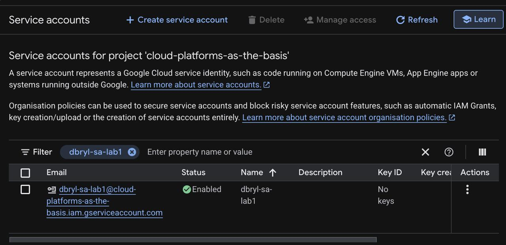
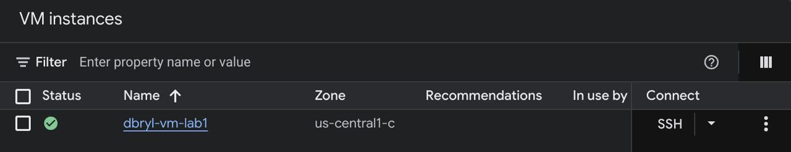
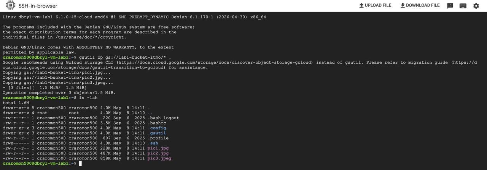
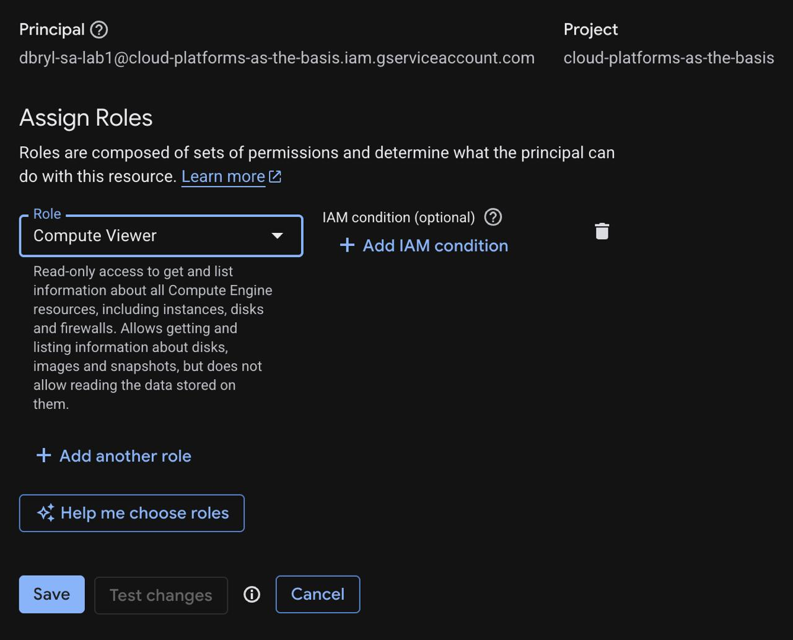
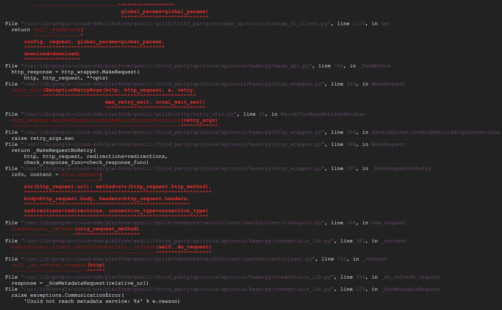

**University:** [ITMO University](https://itmo.ru/ru/)  
**Faculty:** [FICT](https://fict.itmo.ru)  
**Course:** [Cloud platforms as the basis of technology entrepreneurship](https://github.com/itmo-ict-faculty/cloud-platforms)  
**Year:** 2026  
**Group:** U4125  
**Author:** Bryl Denis  
**Lab:** Lab1  
**Date of create:** 08.05.2026  
**Date of finished:** 08.05.2026  

---

# Отчет по выполнению лабораторной работы №1

1. На вкладке Service Accounts создал сервисный аккаунт для того, чтобы виртуальная машина могла взаимодействовать с Cloud Storage от имени этого аккаунта.

2. Создал виртуальную машину. При создании я указал ранее созданный сервисный аккаунт в настройках Identity and API access.

3. Сначала я назначил сервисному аккаунту роль Storage Admin. Зайдя на VM через SSH, я использовал утилиту gsutil для поиска бакета и копирования файлов. Копирование прошло успешно, файлы появились на локальном диске ВМ.

4. Изменил роль сервисного аккаунта с Storage Admin на Compute Viewer.

5. После изменения роли я повторно попытался скопировать данные. Из-за кэширования токенов доступа на стороне виртуальной машины, права обновились с задержкой. Была произведена деактивация аккаунта и сброс конфигурации.

В результате попытка обращения к бакету завершилась технической ошибкой авторизации:
apitools.base.py.exceptions.CommunicationError: Could not reach metadata service: Unauthorized

