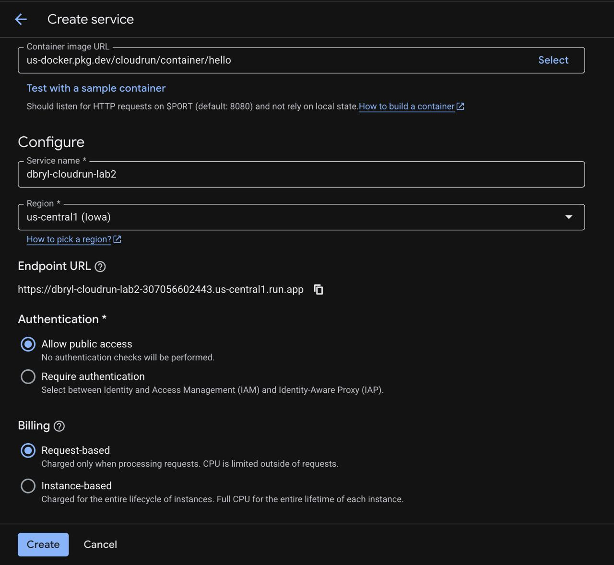
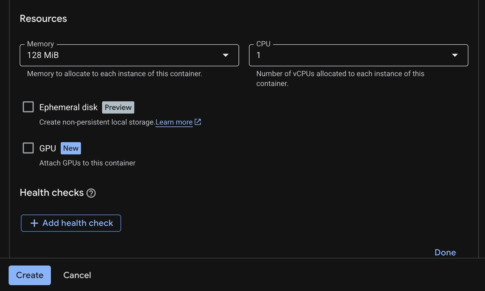
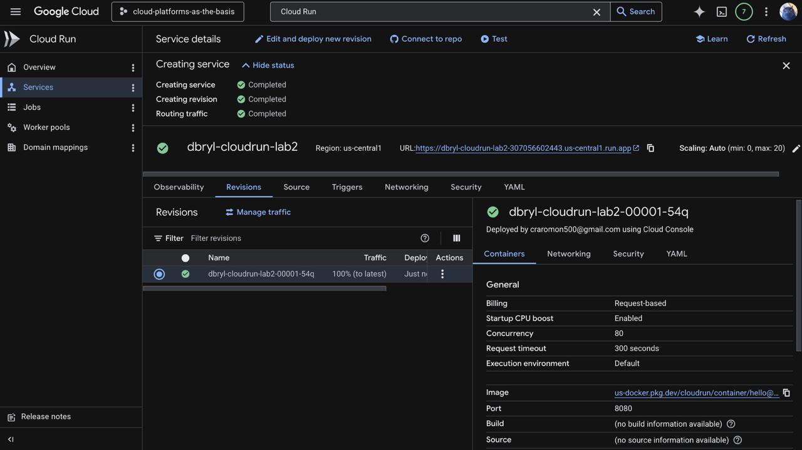
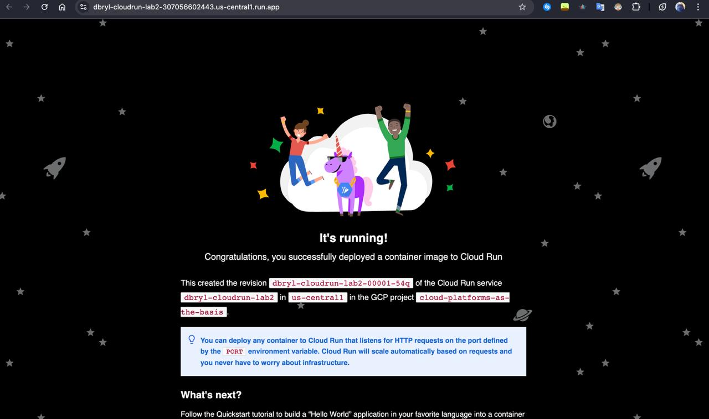
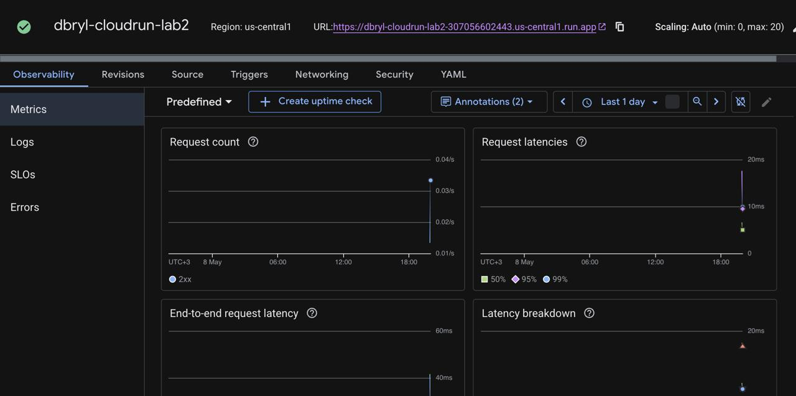
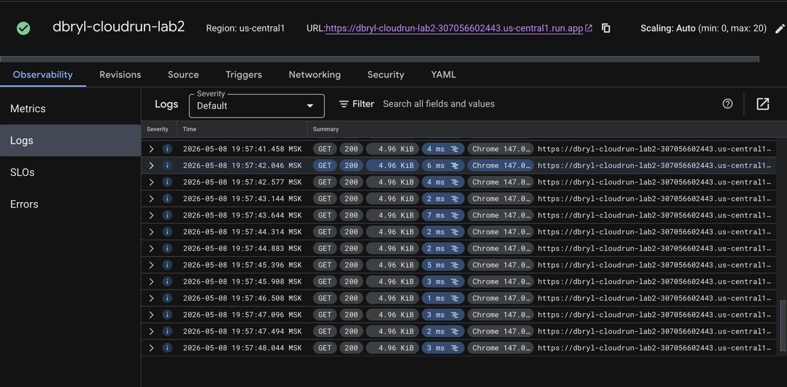
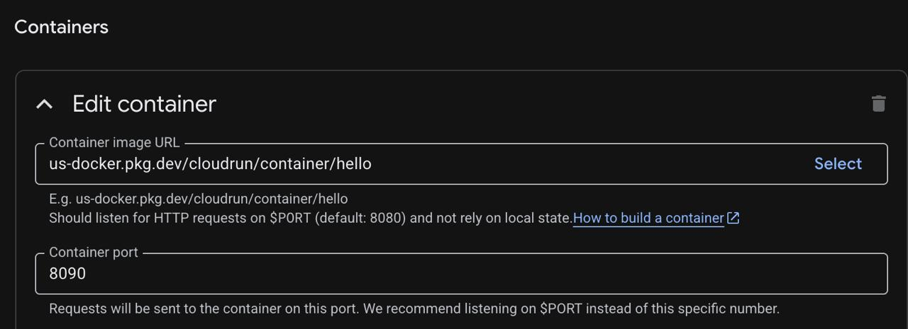
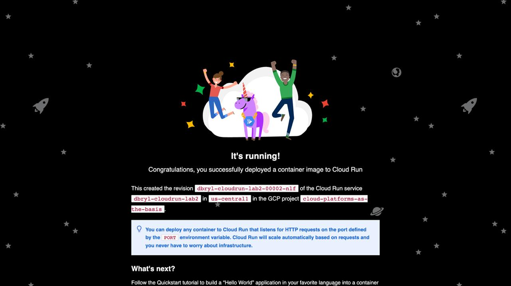
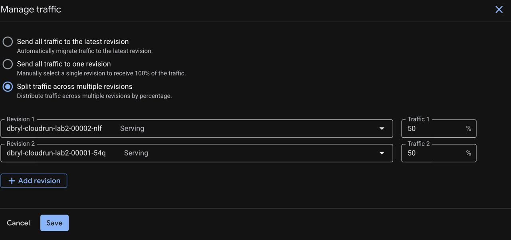
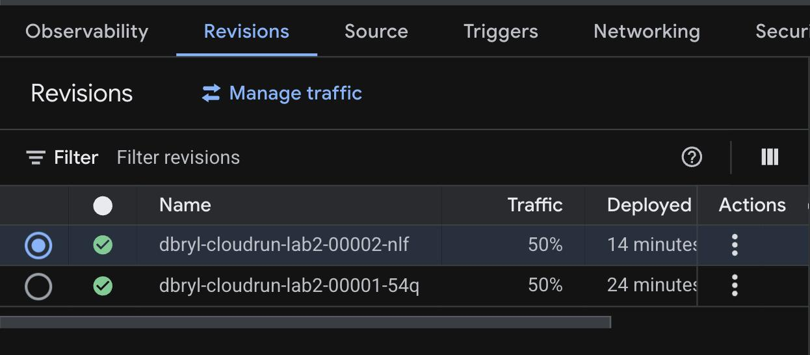

**University:** [ITMO University](https://itmo.ru/ru/)  
**Faculty:** [FICT](https://fict.itmo.ru)  
**Course:** [Cloud platforms as the basis of technology entrepreneurship](https://github.com/itmo-ict-faculty/cloud-platforms)  
**Year:** 2026  
**Group:** U4125  
**Author:** Bryl Denis  
**Lab:** Lab2
**Date of create:** 08.05.2026  
**Date of finished:** 08.05.2026  

# Отчет по выполнению лабораторной работы №2

1. В разделе Cloud Run создал новый сервис. Выбрал стандартный образ hello, регион us-central1 и разрешил публичный доступ, чтобы сервис был доступен по ссылке

2. В настройках контейнера выставил минимальные ресурсы. Ограничил оперативную память до 128 MiB и оставил 1 CPU, чтобы не тратить лишние ресурсы облака

3. После завершения деплоя сервис получил статус активного. Я перешел по сгенерированной ссылке и убедился, что страница "Congratulations" успешно открывается в браузере

4. Изучил работу мониторинга во вкладке Observability. На графиках Metrics появилась активность запросов, а в разделе Logs зафиксировались записи об успешных заходах на сайт со статусом 200

5. Через редактирование конфигурации изменил порт контейнера с 8080 на 8090. Создалась новая ревизия, при этом сервис остался рабочим

6. Протестировал управление трафиком в меню Manage Traffic. Разделил нагрузку между двумя версиями сервиса в пропорции 50 на 50, что позволяет использовать обе ревизии одновременно

7. Удалил сервис из панели управления Cloud Run

