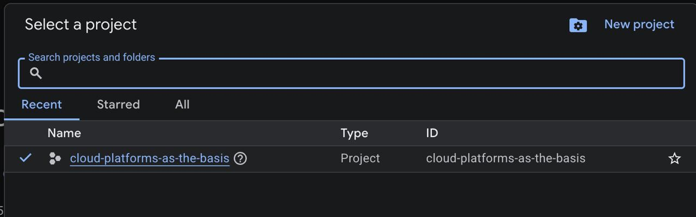
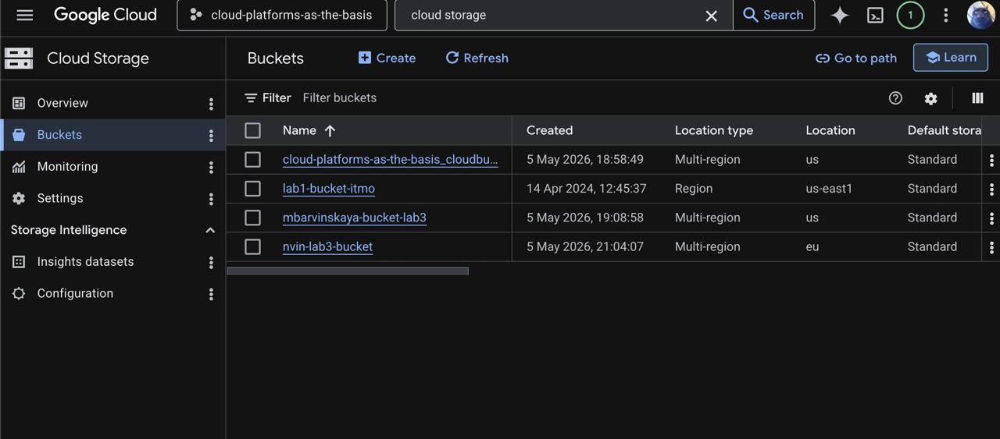
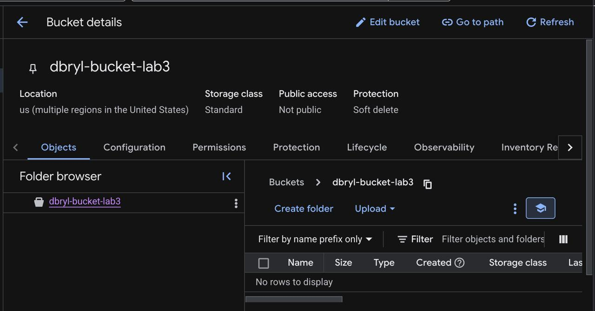
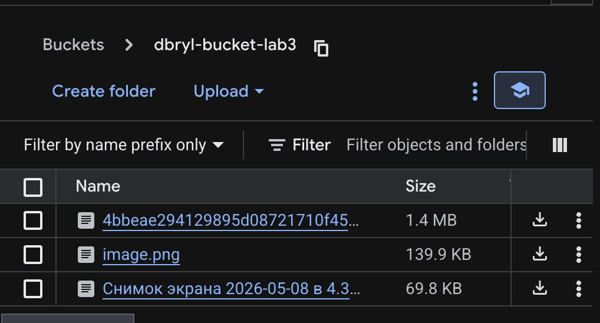
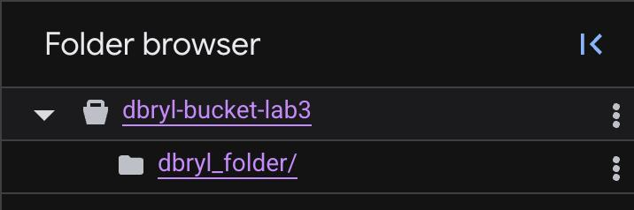
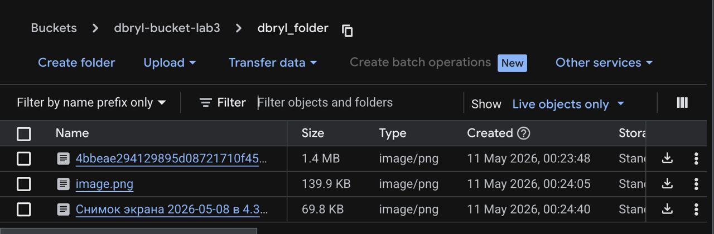
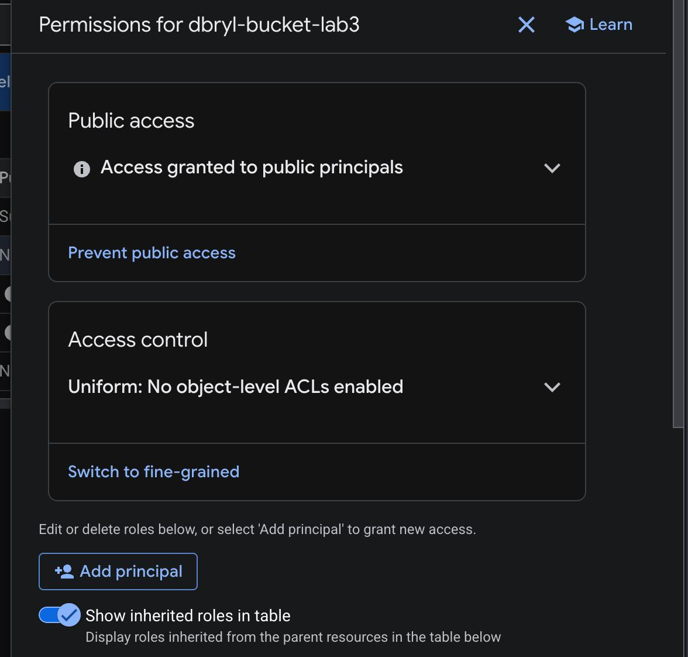
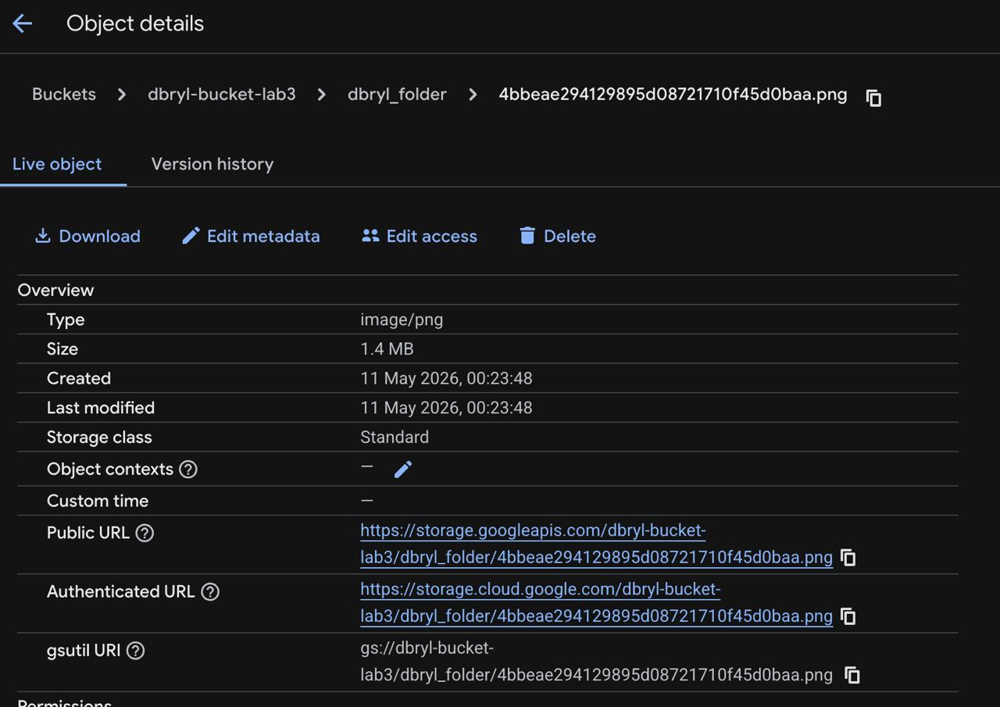
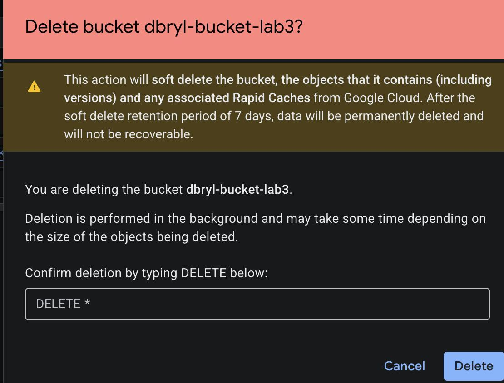

**University:** [ITMO University](https://itmo.ru/ru/)  
**Faculty:** [FICT](https://fict.itmo.ru)  
**Course:** [Cloud platforms as the basis of technology entrepreneurship](https://github.com/itmo-ict-faculty/cloud-platforms)  
**Year:** 2026  
**Group:** U4125  
**Author:** Bryl Denis  
**Lab:** Lab3  
**Date of create:** 08.05.2026  
**Date of finished:** 08.05.2026  

---

# Отчет по выполнению лабораторной работы №3

1. Выбрал текущий проект Cloud_platforms_as_the_basis для работы с облачным хранилищем

2. Перешел в консоль управления Cloud Storage во вкладку Buckets

3. Создал новый бакет dbryl-bucket-lab3. Все настройки региона и класса хранения оставил по умолчанию

4. Загрузил три изображения в корень созданного бакета через кнопку Upload Files

5. Создал папку dbryl_folder и переместил в неё загруженные файлы для структурирования данных

6. Настроил публичный доступ к данным. Для этого в разделе Permissions добавил нового участника allUsers с ролью Storage Object Viewer. В общем списке бакетов появился статус Access granted to public principals

7. Проверил работу публичной ссылки изображениz успешно отобразилось

8. После завершения всех проверок удалил бакет, чтобы не занимать ресурсы облака

