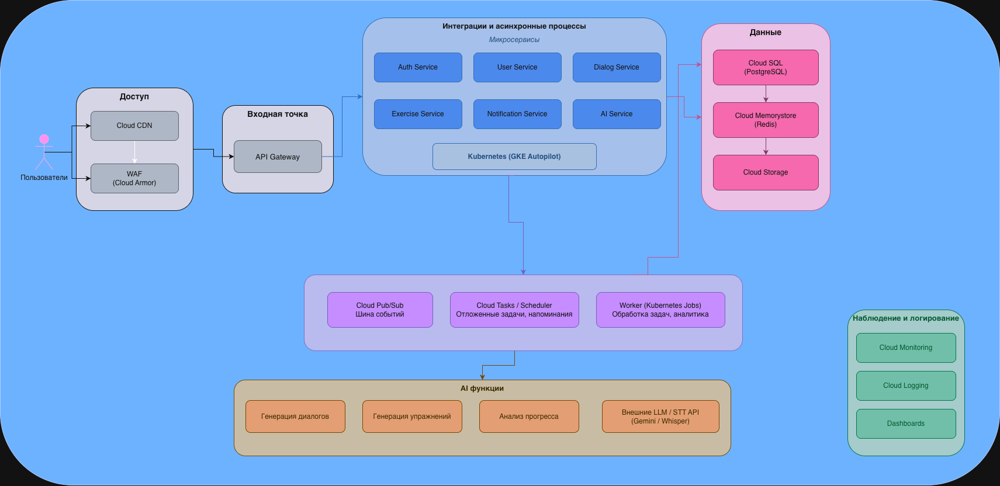

**University:** [ITMO University](https://itmo.ru/ru/)  
**Faculty:** [FICT](https://fict.itmo.ru)  
**Course:** [Cloud platforms as the basis of technology entrepreneurship](https://github.com/itmo-ict-faculty/cloud-platforms)  
**Year:** 2026  
**Group:** U4125  
**Author:** Bryl Denis  
**Lab:** Lab4  
**Date of create:** 08.05.2026  
**Date of finished:** 08.05.2026  

---

# Отчет по выполнению лабораторной работы №3

## Данные о приложении

**Название:** AI-ассистент для изучения иностранных языков «LinguaBot»

**Тип системы:** Внутреннее веб-приложение + мобильная PWA

**Цель системы:** Помочь пользователям изучать иностранные языки с помощью персонализированных AI-диалогов, автоматической проверки произношения, генерации упражнений и отслеживания прогресса.

---

## Основные функции приложения

- Регистрация и авторизация пользователей
- AI-диалоги на изучаемом языке (генерация ответов через LLM)
- Генерация персонализированных упражнений (грамматика, лексика)
- Проверка произношения (Speech-to-Text)
- Отслеживание прогресса и статистика
- Уведомления и напоминания (Email, Push)

---

## Предполагаемая нагрузка

| Этап | Пользователи (MAU) | Запросы в день | AI-запросы в день |
|---|---|---|---|
| MVP | до 500 | ~15 000 | ~5 000 |
| Тестирование | 500–3 000 | ~75 000 | ~25 000 |
| Production | 3 000 и выше | ~300 000 | ~100 000 |

Используется **pay-as-you-go** модель — минимальные затраты при старте, линейное масштабирование при росте нагрузки.

**Итоговая стоимость:** $80 – $2 200 в месяц в зависимости от этапа.

---

## Архитектурная схема

*(см. приложенное в начале отчета изображение)*

---

## Обоснование выбора архитектурных решений

### Cloud CDN
Используется для раздачи статического фронтенда (HTML, JS, CSS, аудиофайлы упражнений).

- Снижает задержки для пользователей в разных регионах
- Уменьшает нагрузку на origin-серверы
- **Стоимость:** $3–100  
- **Источник:** https://cloud.google.com/cdn/pricing (оплата за трафик, pay-as-you-go)

---

### Web Application Firewall — Cloud Armor
Защита от типовых веб-атак: SQL-инъекции, XSS, DDoS.

- Приложение обрабатывает персональные данные пользователей
- Требуется соответствие стандартам безопасности
- **Стоимость:** $5–50  
- **Источник:** https://cloud.google.com/armor/pricing (~$0.05 за GB трафика)

---

### API Gateway
Единая точка входа для всех клиентских запросов.

- Централизованная маршрутизация и авторизация
- Rate limiting — важно для AI-запросов (контроль расходов на LLM)
- Упрощает масштабирование микросервисов
- **Стоимость:** $3–20  
- **Источник:** https://cloud.google.com/api-gateway/pricing

---

### Kubernetes — GKE Autopilot
Платформа для запуска backend-микросервисов.

- Автоматическое масштабирование под нагрузку
- Autopilot снижает DevOps-нагрузку — не нужно управлять нодами вручную
- Отказоустойчивость без изменения архитектуры при росте
- **Стоимость:** $10–500  
- **Источник:** https://cloud.google.com/kubernetes-engine/pricing ($0.10/час за кластер)

---

### Микросервисная архитектура
Сервисы разделены на независимые компоненты:

- **Auth Service** — регистрация, авторизация, JWT
- **User Service** — профиль, настройки, прогресс
- **Dialog Service** — управление AI-диалогами
- **Exercise Service** — генерация и проверка упражнений
- **Notification Service** — Email и Push-уведомления
- **AI Service** — интеграция с внешними LLM/STT API

Преимущества: независимое развитие, масштабирование только нагруженных сервисов (AI Service при росте запросов).

**Стоимость:** включена в стоимость GKE.

---

### Cloud SQL (PostgreSQL)
Основная реляционная БД приложения.

- Хранит данные пользователей, историю диалогов, прогресс
- Поддержка транзакций, высокая надёжность
- На этапе Production — HA + replica для отказоустойчивости
- **Стоимость:** $15–300  
- **Источник:** https://cloud.google.com/sql/pricing

---

### Redis — Cloud Memorystore
Кэш для часто запрашиваемых данных.

- Кэширование сессий и токенов авторизации
- Кэш результатов прогресса (dashboard пользователя)
- Снижает нагрузку на PostgreSQL
- **Стоимость:** $15–150  
- **Источник:** https://cloud.google.com/memorystore/docs/redis/pricing

---

### Event-driven архитектура — Cloud Pub/Sub
Асинхронная шина событий для уведомлений, аналитики, обработки AI.

- Снижает связанность сервисов
- Позволяет обрабатывать задачи независимо от пользовательских запросов
- Повышает устойчивость при пиковых нагрузках
- **Стоимость:** $5–80  
- **Источник:** https://cloud.google.com/pubsub/pricing

---

### Cloud Tasks / Cloud Scheduler
Отложенные задачи и периодические напоминания пользователям.

- Ежедневные напоминания об уроках
- Асинхронная генерация отчётов прогресса
- Не блокирует основной поток запросов
- **Стоимость:** $3–30  
- **Источник:** https://cloud.google.com/tasks/pricing

---

### Worker (Kubernetes Jobs)
Фоновые вычислительные задачи.

- Анализ прогресса пользователей
- Генерация персонализированных упражнений
- Тяжёлые задачи отделены от пользовательского API
- **Стоимость:** включена в стоимость GKE

---

### Внешние AI API (LLM + Speech-to-Text)
Используются для генерации диалогов, упражнений и проверки произношения.

- Не нужно обучать собственные модели — быстрый запуск MVP
- Оплата только за использование (pay-per-token)
- При росте нагрузки — оптимизация через кэширование частых запросов
- **Стоимость:** $5–1 000  
- **Источник:** https://cloud.google.com/products/gemini-enterprise-agent-platform/pricing

---

### Monitoring и Logging
Cloud Monitoring, Cloud Logging, Dashboards.

- Обнаружение ошибок и аномалий в реальном времени
- Анализ использования AI-запросов (контроль расходов)
- Обязательны для production и комплаенса
- **Стоимость:** $5–100  
- **Источник:** https://cloud.google.com/products/observability/pricing

---

## Таблица расчёта стоимости инфраструктуры

### Compute (GKE Autopilot)

| Показатель | MVP | Тестирование | Production |
|---|---|---|---|
| CPU (vCPU avg) | 0.2 | 0.8 | 3–5 |
| RAM | 0.5 GB | 2 GB | 8–16 GB |
| **Стоимость** | **$10–30** | **$50–120** | **$200–500** |

### Database (Cloud SQL PostgreSQL)

| Показатель | MVP | Тестирование | Production |
|---|---|---|---|
| Размер БД | 3–8 GB | 15–40 GB | 80+ GB |
| Инстанс | micro | small | HA + replica |
| **Стоимость** | **$15–30** | **$40–80** | **$150–300** |

### Redis (Cloud Memorystore)

| Показатель | MVP | Тестирование | Production |
|---|---|---|---|
| RAM | 1 GB | 2–4 GB | 8–16 GB |
| **Стоимость** | **$15–25** | **$30–60** | **$80–150** |

### Cloud Storage

| Показатель | MVP | Тестирование | Production |
|---|---|---|---|
| Объём | 30 GB | 100 GB | 400 GB |
| **Стоимость** | **$1–3** | **$5–15** | **$15–40** |

### CDN + Трафик

| Показатель | MVP | Тестирование | Production |
|---|---|---|---|
| Трафик | 30–80 GB | 150–400 GB | 800 GB–1.5 TB |
| **Стоимость** | **$3–10** | **$15–40** | **$40–120** |

### Pub/Sub

| Показатель | MVP | Тестирование | Production |
|---|---|---|---|
| Сообщений/день | 5k | 30k | 150k |
| **Стоимость** | **$3–8** | **$10–25** | **$25–70** |

### AI API (LLM + STT)

| Показатель | MVP | Тестирование | Production |
|---|---|---|---|
| AI-запросов/день | ~5 000 | ~25 000 | ~100 000 |
| **Стоимость** | **$5–50** | **$50–300** | **$300–1 000** |

### Monitoring & Logging

| Показатель | MVP | Тестирование | Production |
|---|---|---|---|
| Логов/день | 0.5–1 GB | 3 GB | 8+ GB |
| **Стоимость** | **$3–10** | **$15–30** | **$40–100** |

---

### Итоговая стоимость

| Этап | Мин. | Макс. |
|---|---|---|
| MVP | **~$55** | **~$166** |
| Тестирование | **~$215** | **~$670** |
| Production | **~$850** | **~$2 280** |

> Использование облачных управляемых сервисов Google Cloud позволяет минимизировать затраты на старте, масштабировать систему без изменения архитектуры и контролировать расходы за счёт модели pay-as-you-go. Наибольшую долю затрат на этапе Production составляет стоимость AI API — для оптимизации рекомендуется кэширование типовых запросов и батчинг.